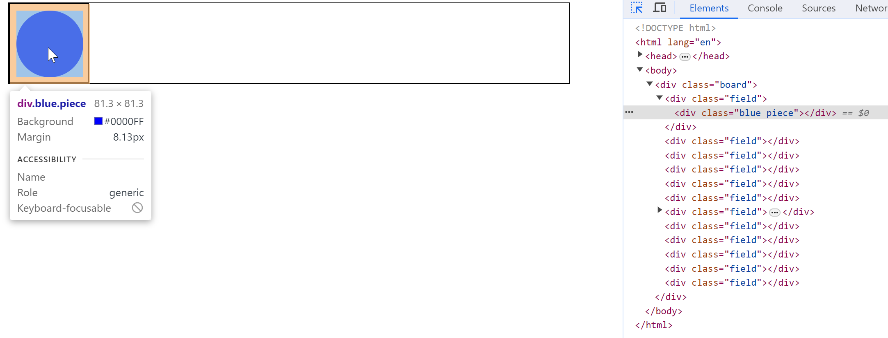
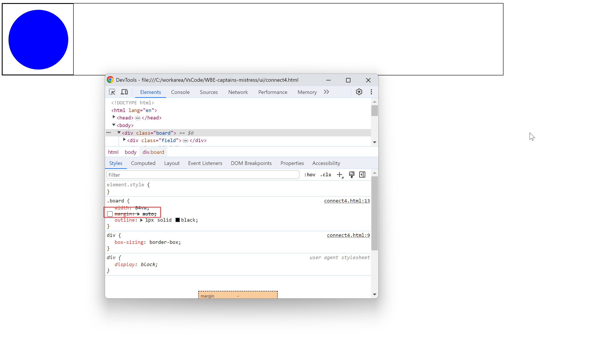
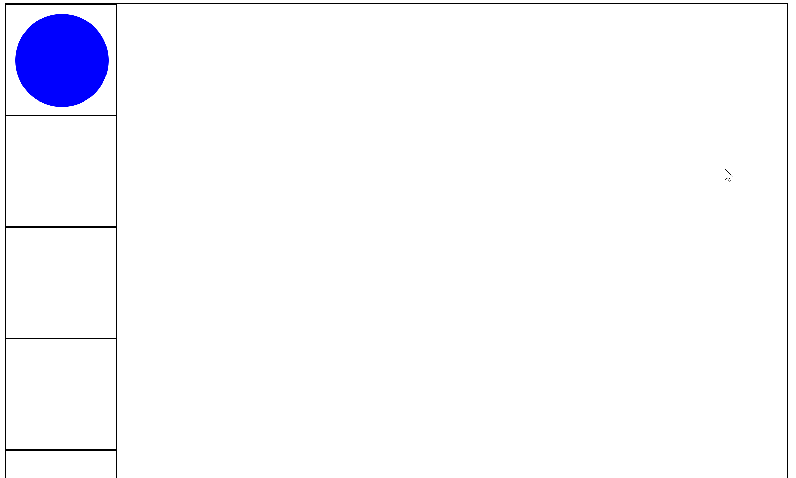
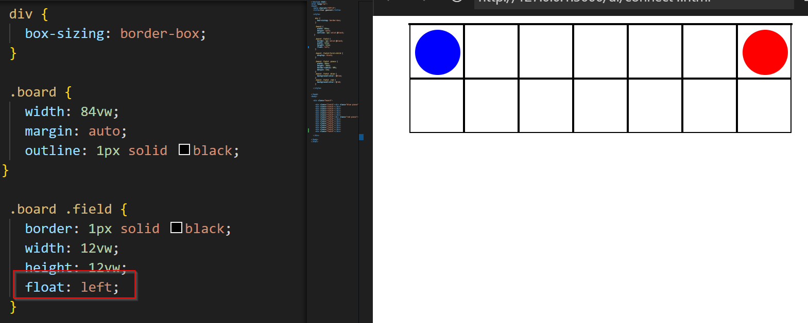

## Aufgabe1

### Sehen Sie sich die Ausgabe im Browser-Fenster an. Welchem HTML-Element entspricht der blaue Kreis und welche CSS-Eigenschaften werden für seine Darstellung verwendet? Wie wird erreicht, dass sich die Grösse des Spielfelds an der Grösse des Viewports orientiert? 

Der blaue Kreis entspricht einem div mit der Klasse 'blue circle'

Die Grösse des Spielfelds enthält einfach ein margin, falls das gemeint ist


### Entfernen Sie die CSS-Angaben, welche dafür sorgen, dass nur das erste Feld angezeigt wird. Da div ein Blockelement ist, werden die Felder nun untereinander dargestellt. 

Ich entfernte display: none vom .board .field



### Passen Sie das CSS so an, dass zwei Zeilen à sieben Feldern angezeigt werden. Am besten lösen Sie das mit fliessenden Boxen (float). Wenn Sie Flexbox oder CSS-Grid kennen, können Sie auch eine von diesen Varianten verwenden – in diesem einfachen Beispiel sind alle drei Varianten nicht sehr aufwändig.


Alternativ kann man es auch so lösen:
```css
.board .field {
  border: 1px solid black;
  width: 12vw;
  height: 12vw;
  display: flex;
  flex-wrap: wrap;
}
```

### Machen Sie noch einmal klar, wie elt funktioniert. Welche Argumente werden beim Aufruf angegeben? Was ist der Rückgabewert? Schlagen Sie unbekannte Funktionen oder Methoden in einer Dokumentation nach

done.

### Entfernen Sie die div-Elemente mit der Klasse field aus dem HTML-Code. Schreiben Sie JavaScript-Code, welcher beim Laden des Dokuments sechs Zeilen mit je sieben leeren Feldern erzeugt

```html
<body>

  <div class="board">

    <script src="build_board.js"></script>

  </div>

</body>
```
[build_board.js](../ui/build_board.js)

### Ergänzen Sie Ihr Script so, dass in einigen der Felder eine rote oder blaue Spielfigur eingefügt wird, am besten gesteuert durch den Zufallszahlengenerator, Aufruf: Math.random()

```javascript
// Generate a random number between 0 and 1
var randomNumber = Math.random();

if (randomNumber < 0.25) {
  innerDiv = elt('div', 'blue piece');
} else if (randomNumber < 0.5) {
  innerDiv = elt('div', 'red piece');
}
```
