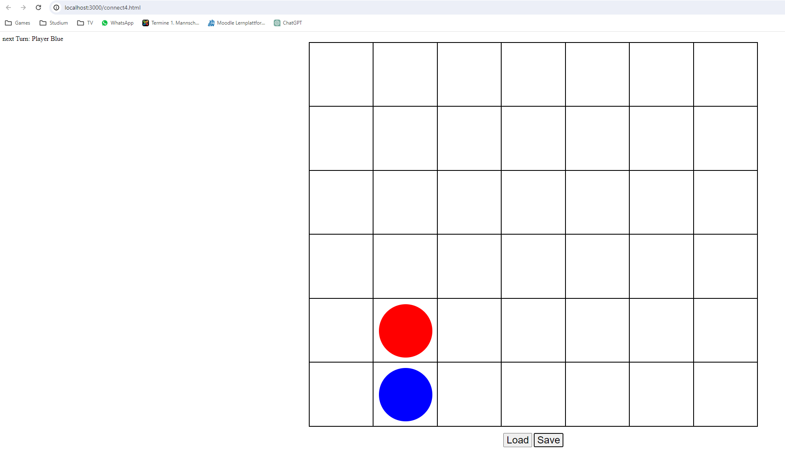

## Aufgaben

### Zunächst zum Server. Wie schon im früheren Praktikum verwenden wir Express für den Server. Um auch statische Dateien wie unsere HTML- und CSS-Dateien übertragen zu können, ist eine zu-sätzliche Middleware nötig. Ausserdem rlauben wir einen zusätzlichen API-Key c4game. Sehen Sie sich index.js mit den zugehörigen Änderungen an. 

Done

### Ergänzen Sie die Datenbank des Servers (Variable data) um den Anfangszustand für unser Spiel. Wählen Sie einen geeigneten Schlüssel für den Zugriff

```javascript
//  unsere tolle in-memory Datenbank :)
var data = {
  1234567890: {demodata: "wbe is an inspiring challenge"},
  0: {initialState: ""}
}
```

### Unter public ist bereits ein Gerüst von connect4.html und das Stylesheet. Ergänzen Sie die Dateien um die nötigen Scripts aus den letzten beiden Praktika.

Done

### Installieren Sie die zusätzlich benötigten Module (npm install). Wenn Sie den Server nun starten (node index.js) sollten Sie das Spiel laden können (http://localhost:3000/connect4.html).



### Nun zum Client. Ergänzen Sie die Seite um zwei Buttons «Laden» und «Speichern».

Done

### Beim Klick auf «Speichern» soll der aktuelle Spielzustand mit PUT auf dem Server gespeichert werden.

```javascript
//  Get current state from server and re-draw board
//
function loadState () {
  fetch(SERVICE).then(response => response.json()).then(newState => {
    state = newState
    showBoard();
  }).catch((error) => {
    console.error('Error loading state:', error);
  });
}

//  Put current state to server
//
function saveState () {
  fetch(SERVICE, {
      method: 'PUT', // Assuming you use POST to save the game state
      headers: {
        'Content-Type': 'application/json',
      },
      body: JSON.stringify(state), // Send the current state to the server
  });
}
```

